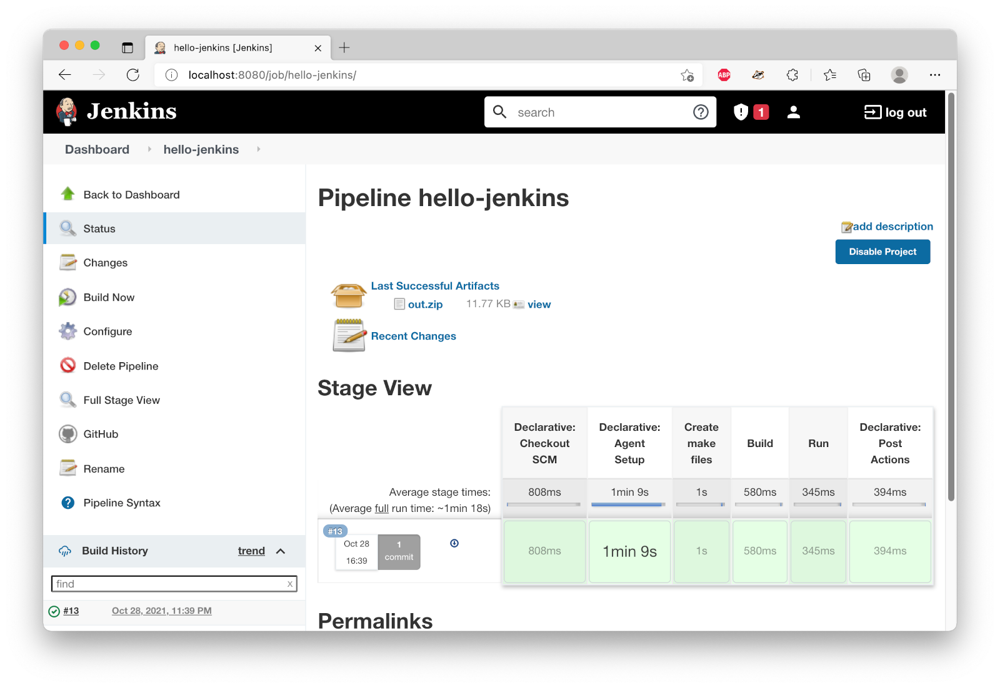

# cpplayground-Jenkins

A demo project that sets up a Jenkins CI pipeline to build C++ projects from GitHub using Docker containers. 



## Prerequisites 
Docker installed and running on the host machine (tested on MacOS 11.6, arm64)
## References
Useful resources:
- https://hub.docker.com/r/jenkins/jenkins
- https://github.com/jenkinsci/docker/blob/master/README.md
- https://www.jenkins.io/doc/book/installing/docker/

## Steps

We are going to install Jenkins in a container, and we need docker-in-docker container to execute our builds. The two containers need to communicate with each other over a common network. 

1. Create a network for the containers:
```
docker network create jenkins
```

2. Run a docker-in-docker container by using the command below. Note that we map 'jenkins_home' folder that will contain our project files. This is essential for Jenkins to share files with the worker container that will execute the build. 
```
docker run --name jenkins-docker -d --privileged --network jenkins --network-alias docker --env DOCKER_TLS_CERTDIR=/certs -v jenkins-docker-certs:/certs/client -v jenkins_home:/var/jenkins_home -p 2376:2376 docker:dind --storage-driver overlay2
```

3. Next we build our Jenkins container. We use the baseline 'jenkins:lts-jdk11' image, be we need to add docker-ce-cli to it so that Jenkins can execute 'docker' commands. This is done using a [dockerfile](Jenkins-setup/Jenkins.Dockerfile). 

```
docker build -t mr.jenkins -f Jenkins-setup/Jenkins.Dockerfile Jenkins-setup/
```

4. Run Jenkins server 
```
docker run --name jenkins1 -d --network jenkins --env DOCKER_HOST=tcp://docker:2376 --env DOCKER_CERT_PATH=/certs/client --env DOCKER_TLS_VERIFY=1 -p 8080:8080 -p 50000:50000 -v jenkins_home:/var/jenkins_home -v jenkins-docker-certs:/certs/client:ro mr.jenkins
```

5. Open Jenkins at http://localhost:8080 
	- Set up an account
	- install plugins: git, GitHub, Docker, Docker Pipeline

6. Create a new Pipeline
	- Select GitHub project and set the URL
	- In Pipeline: select "Pipeline script from SCM"
	- For SCM, select Git and set GitHub project URL
	- Save the project

7. Build the pipeline

